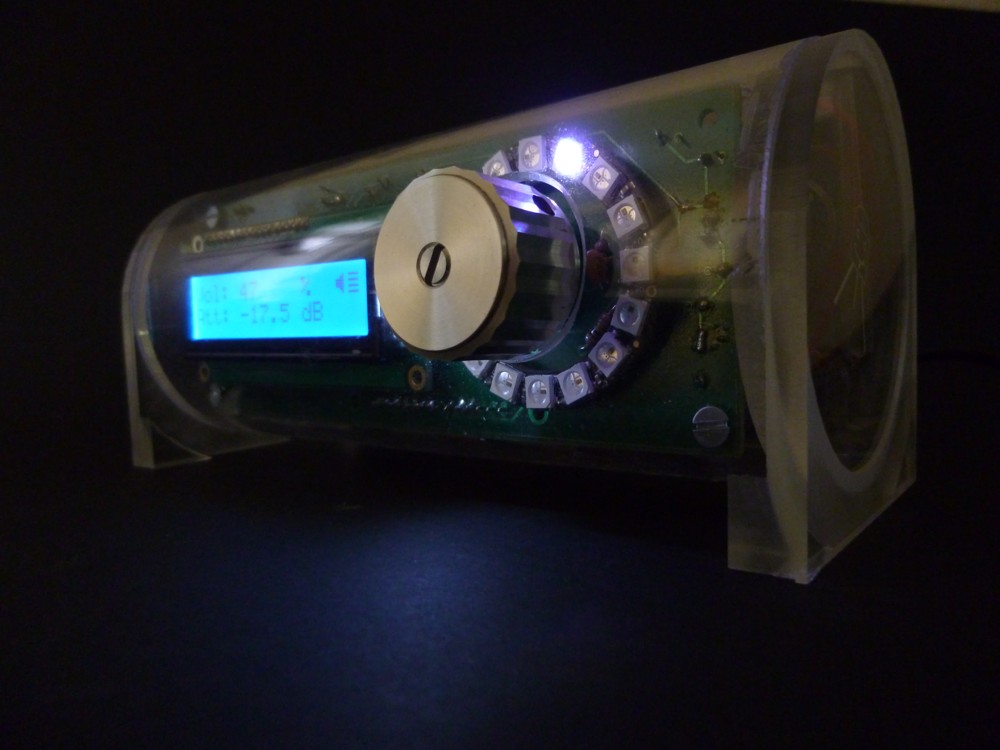

#Amplifier firmware

Built this amplifier based on the adafruit class D max9744 breakout board.

An atmega328 does the userinterface <-> max9744 (I2C) handling for volumecontrol and mute/unmute
and other interface gimmicks.

##pcb

##the amp

